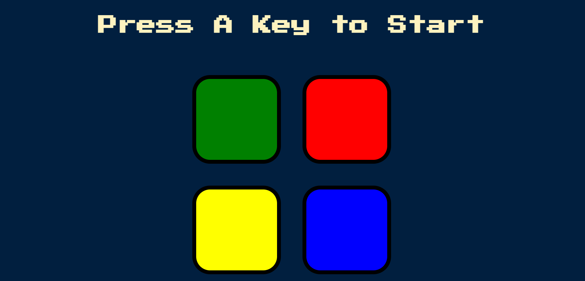
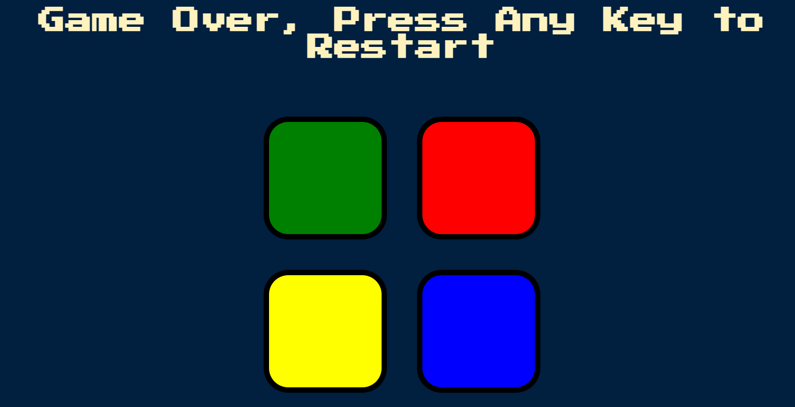
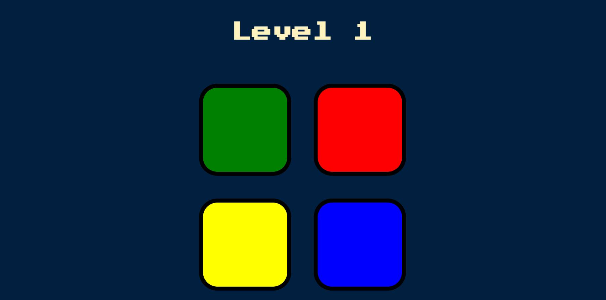

# Simon-Game
Used HTML , CSS ,  JavaScript (jQuery).
The Simon game is a classic memory game that challenges players to repeat a sequence of colors and sounds in the correct order. This project, made using HTML, CSS, JavaScript, and jQuery, is an implementation of this game that is playable in a web browser.
This project uses JavaScript and jQuery to create the game logic, including generating random sequences, playing sounds, and checking the player's input against the correct sequence. The HTML and CSS provide the visual and interactive elements of the game, including the buttons and game over message.

